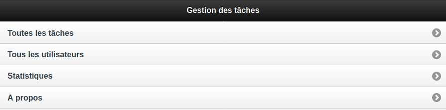
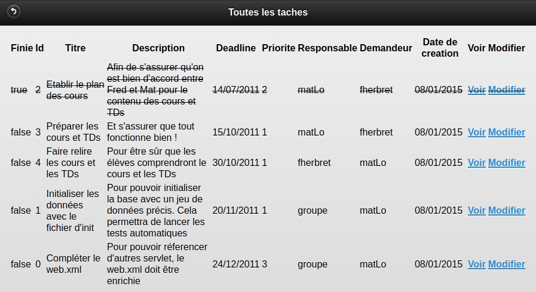
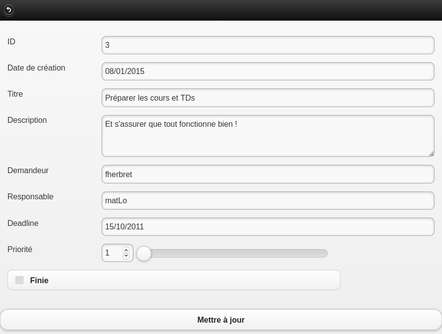

# Web/XML Project with Jetty

Todo list server with an XML API.

## Build

```
$ ./build.sh
```

## Run

```
$ java -jar start.jar
```

The server is listening on `http://127.0.0.1:10010/EnseirbWebXMLWebapp/`.

## Screenshots




